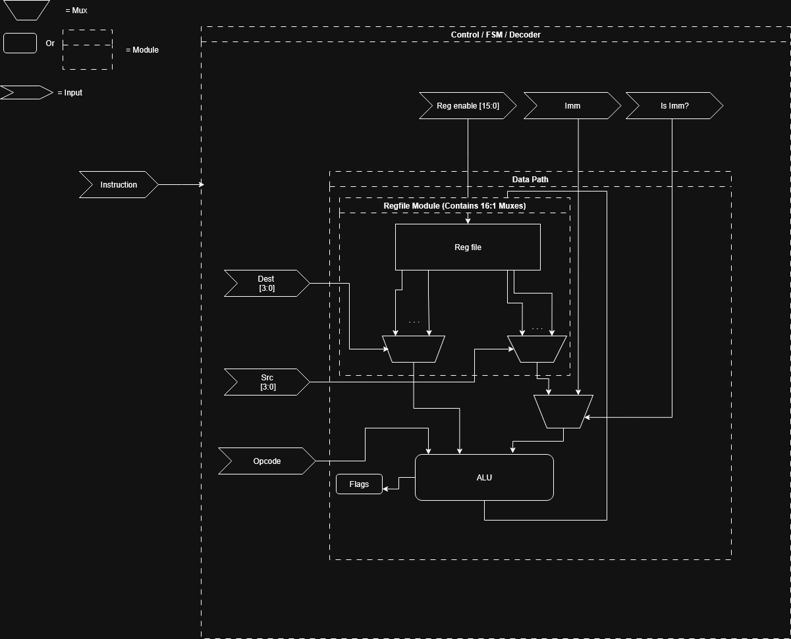

# 3710 Project

## Project Overview
This project implements a custom CPU with VGA graphics and PS/2 keyboard input to create an endless runner game on an FPGA. The player controls a player sprite that must jump over cacti obstacles using the spacebar.
- **Player:** Player at fixed X position, Y position controlled by jump physics
- **Obstacles:** Cacti scroll from right to left at fixed Y position
- **Collision Detection:** Implemented in assembly game code

### Compilation Instructions
- Set the top-level entity to be cpu_top.v
- Before compiling, ensure the memory files for game code and sprite hex values are properly linked using the correct location.

### Running the Game
1. Connect VGA monitor to the board
2. Connect PS/2 keyboard to the board
3. Power on the board and program it with the `.sof` file
4. Press **KEY[0]** on the FPGA to reset if needed
5. Use **SPACEBAR** to make the player jump over cacti
6. Game runs indefinitely. Avoid the obstacles to continue playing

### Pin Assignments
Exact pin assignments are located in `/resources/pin_out.qsf` for the pins below:
- **VGA Pins:** VGA_R[7:0], VGA_G[7:0], VGA_B[7:0], VGA_HS, VGA_VS, VGA_CLK, VGA_BLANK_N, VGA_SYNC_N
- **PS/2 Pins:** PS2_CLK, PS2_DAT
- **Clock:** 50 MHz system clock (CLOCK_50)
- **Reset:** KEY[0] (active low)

### VGA Subsystem Details
- **Resolution:** 640×480 @ 60Hz
- **Color Format:** RGB888 output (RGB565 stored in ROM)
- **Sprite ROM Memory Map:** for `../Sprites/Combined_manWalking+Cactus+bg.hex`
  - Addresses 0-4095: Player animation (4 frames, 32×32 each)
  - Addresses 4096-5119: Cactus obstacle (32×32)
  - Addresses 5120+: Background tiles

### Authors' Contributions
- **Evelyn:** PS/2 keyboard interface, CPU testing and debugging
- **Anthony:** Top-level CPU integration, assembler, game logic
- **Ian:** Dual-port RAM, PS/2 controller, VGA-game integration
- **Martin** Complete VGA subsystem design and implementation

**Last Updated:** December 10th 2025

---

## ALU Instructions

---

closely follows implementation listed [here](https://my.eng.utah.edu/~cs3710/handouts/cr16a-prog-ref.pdf)

Destination input = A, Src input = B. This means CMP does A<B and SUB does A-B.

src2 = A src1 = B for cmp instruction

## Lab 1 List of instructions

---

- ADD = 4'b0101
- ADDU = 4'b0110
- ADDC = 4'b0111
- SUB = 4'b1001
- SUBC = 4'b1010
- CMP = 4'b1011
- AND = 4'b0001
- OR = 4'b0010
- XOR = 4'b0011
- MOV = 4'b1101
- LSH = 4'b0100
- NOT = 4'b1000
- ASHU = 4'b1100
- NOP = 4'b0000

## Lab 2:

---

### Questions

- How many read and write ports should your regfile have? What control signals will be needed to control read
  and write operations.

- Would you prefer a MUX or a TRI-BUF interface? Keep in mind that modern FPGA synthesis tools will not
  generate tri-state buffers in the logic, and will convert tri-state buffers into MUXes. I strongly recommend that
  you guys design a MUX-based architecture.

- How would you organize the regfile to interface with the ALU? Think about the data-path bus interface between
  the regfile and the ALU.

- How will you integrate the ALU Flags with the regfile? Are the flags a separate set of (processor status)
  registers, or one of the registers in the regfile is dedicated to work as a flag register?

- How will you design a TestBench that will perform a sequence of reads and writes to and from the regfile,
  via the ALU?

- Will the Reg file be a 2D design or 1D / traditional design?

### Modules / Tasks

- Bus module
- MUX module
- REG File module
- Bus module tb (Evelyn)
- MUX module tb
- REG File module tb
- FSM Fib (Anthony / Evelyn) TBD per anthony's implementation
- FSM Our implementation (Martin) TBD per anthony's implementation
- Put all on FPGA (Ian)

### Commitments

- We should try to get the implementation and testbenches done next week (by Sept 11th) so that we have time for the report
- The report is 7-8 pages (Like actually? 3700 was 8 pages of graphics, is it the same for this?)
  - If the report is really 7-8 pages of text, lets use the last week to get it done.
- RTL Diagram

### Block diagram

## Lab 3 - Memory

---

### Design choices:
- On dual channel where both channels recieve a write instuction to the same address at the same time (Write conflict), channel A will be the one to write to the address. 
